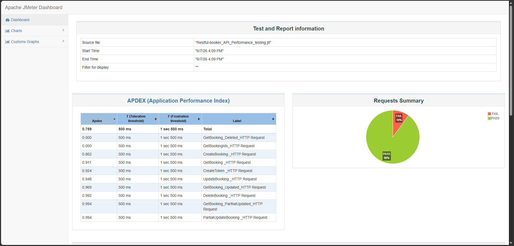
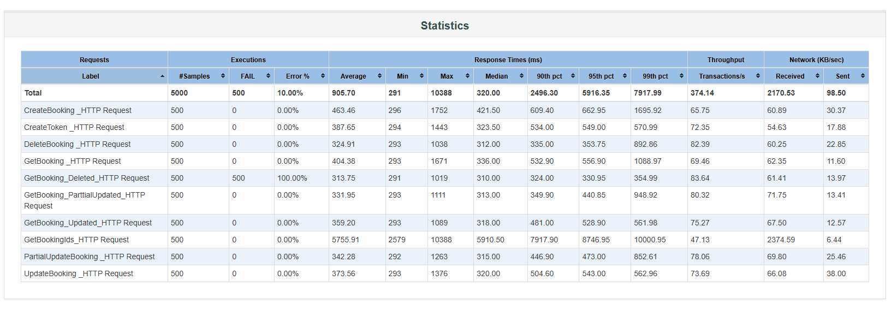
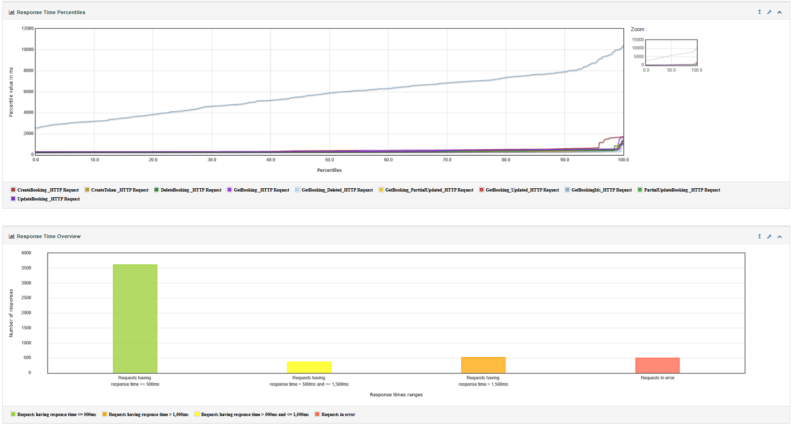

# 🚀 Restful Booker API Performance Testing using Apache JMeter

<p align="center">
  
  
  
  
</p>

---

# 📌 Project Overview

This project focuses on **Performance Testing** of the **Restful Booker API** using **Apache JMeter**.

The primary goal of this project is to evaluate:

* API response time
* Throughput
* Concurrent user handling
* Server stability under load
* Error percentage
* Overall application performance

The test suite was executed in **Non-GUI Mode** for optimized performance testing and detailed HTML dashboard reports were generated for analysis.

---

# 🛠️ Technologies Used

| Tool               | Purpose              |
| ------------------ | -------------------- |
| Apache JMeter      | Performance Testing  |
| Restful Booker API | API Under Test       |
| HTML Dashboard     | Report Visualization |
| Git & GitHub       | Version Control      |
| CSV / JTL          | Result Logging       |

---

# 📂 Project Structure

```bash
📦 Restful-Booker-Performance-Testing
│
├── 📁 TestPlan
│   └── Restful-booker_API_Performance_testing.jmx
│
├── 📁 Results
│   └── Restful-booker_API_Performance_testing.jtl
│
├── 📁 Report
│   ├── index.html
│   ├── content/
│   └── statistics.json
│
├── 📁 Screenshots
│   ├── dashboard.png
│   ├── throughput.png
│   └── statistics.png
│
└── README.md
```

---

# 🎯 Test Objectives

The following objectives were covered during testing:

✅ Validate API stability under load
✅ Measure response time and latency
✅ Analyze throughput performance
✅ Detect bottlenecks and failures
✅ Generate detailed performance reports
✅ Evaluate scalability of the API system

---

# 🔍 API Endpoints Tested

| API Endpoint   | Method |
| -------------- | ------ |
| Authentication | POST   |
| Create Booking | POST   |
| Get Booking    | GET    |
| Update Booking | PUT    |
| Delete Booking | DELETE |

---

# ⚡ Load Testing Configuration

| Configuration   | Value               |
| --------------- | ------------------- |
| Number of Users | 100+                |
| Ramp-Up Period  | Configurable        |
| Loop Count      | Multiple Iterations |
| Test Mode       | Non-GUI             |
| Report Type     | HTML Dashboard      |

---

# 📊 Performance Metrics Analyzed

The following metrics were analyzed from the JMeter dashboard report:

* APDEX Score
* Average Response Time
* Error Percentage
* Throughput
* Transactions Per Second
* Response Time Distribution
* Concurrent Requests
* Top Errors Analysis

---

# 📈 HTML Dashboard Report

The generated dashboard report includes:

* 📌 APDEX Analysis
* 📌 Request Summary
* 📌 Throughput Graph
* 📌 Response Time Graph
* 📌 Error Statistics
* 📌 Top 5 Errors
* 📌 Detailed Statistics Table

---

# 🖼️ Report Screenshots

## Dashboard Overview

<p align="center">
  
</p>

---

## Statistics

<p align="center">
  
</p>

---

## Throughput Graph

<p align="center">
  
</p>

---


# ▶️ How to Run the Test

## Run JMeter Test in Non-GUI Mode

```bash
jmeter -n -t Restful-booker_API_Performance_testing.jmx -l results.jtl
```

---

## Generate HTML Report

```bash
jmeter -g results.jtl -o report
```

---

## Run Test + Generate Report Together

```bash
jmeter -n -t Restful-booker_API_Performance_testing.jmx -l results.jtl -e -o report
```

---

# 📄 View Report

Open the following file in browser:

```bash
report/index.html
```

---

# 📌 Key Learning Outcomes

Through this project, I gained practical experience in:

* API Performance Testing
* Load Testing & Stress Testing
* Apache JMeter Test Plan Design
* HTML Dashboard Report Analysis
* Throughput & Latency Analysis
* Error Investigation
* Non-GUI Execution
* Real-world Performance Monitoring

---

# 🚀 Future Improvements

* Add Distributed Load Testing
* Integrate CI/CD Pipeline
* Add Automated Performance Benchmarking
* Integrate Grafana & InfluxDB
* Cloud-based Load Testing

---

# 👨‍💻 Author

## Md Abdul Sattar Nayan

🎓 Department of Computer Science & Engineering
🏛️ Comilla University

---

# ⭐ If You Like This Project

Give this repository a ⭐ on GitHub.

---

# 📜 License

This project is created for educational and learning purposes.
